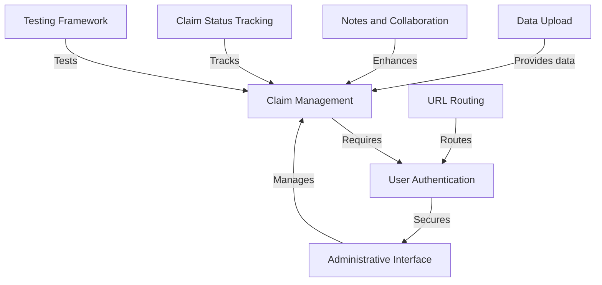
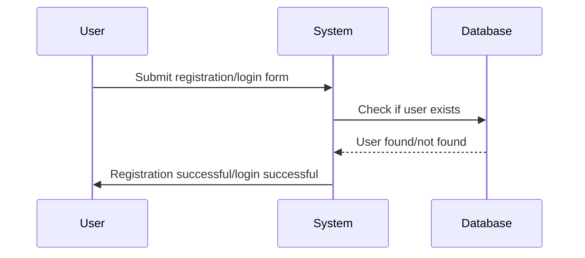
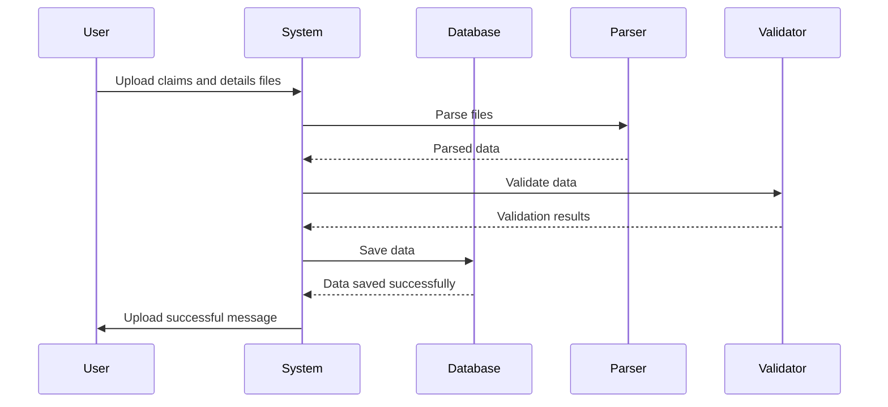
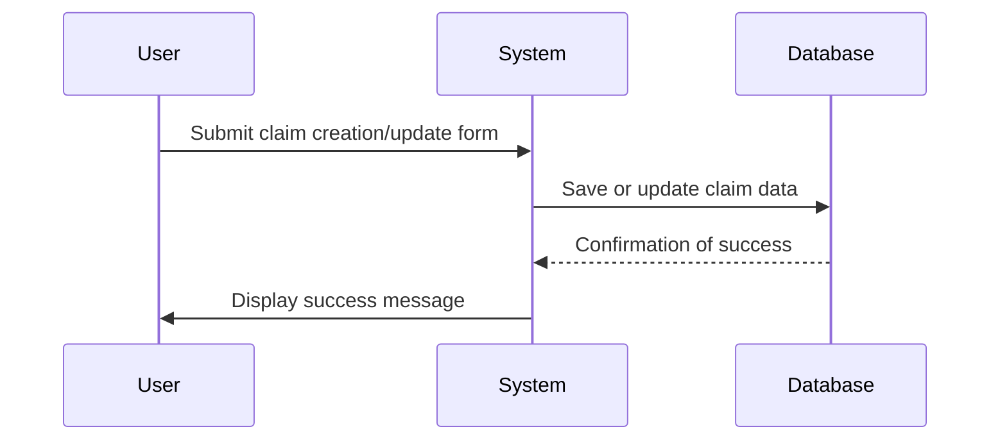
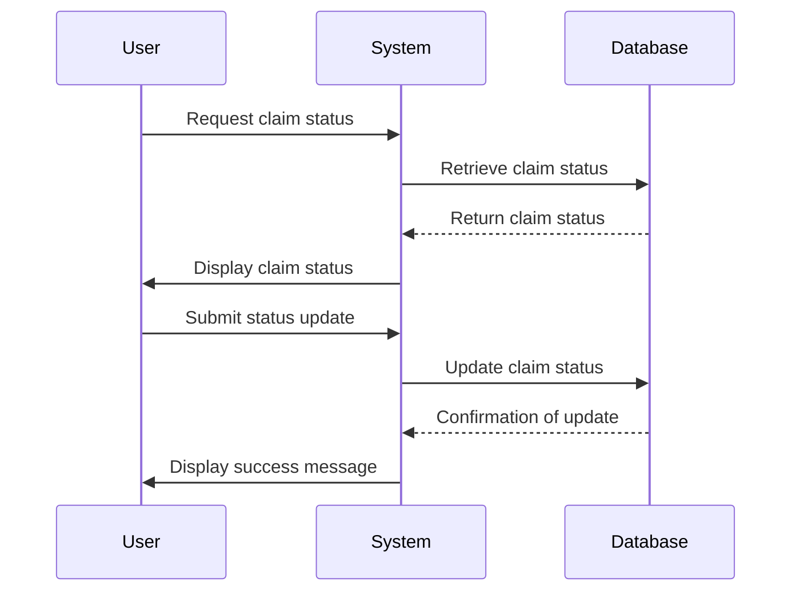
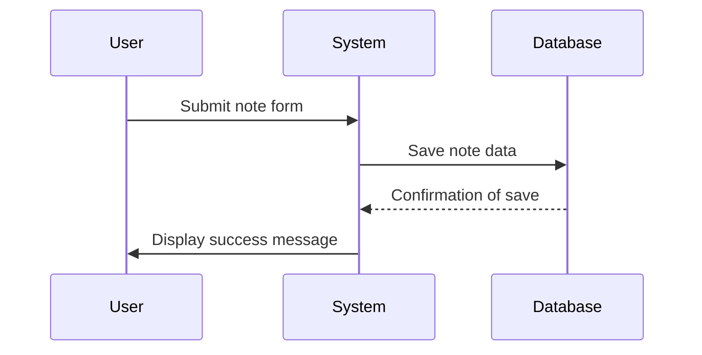
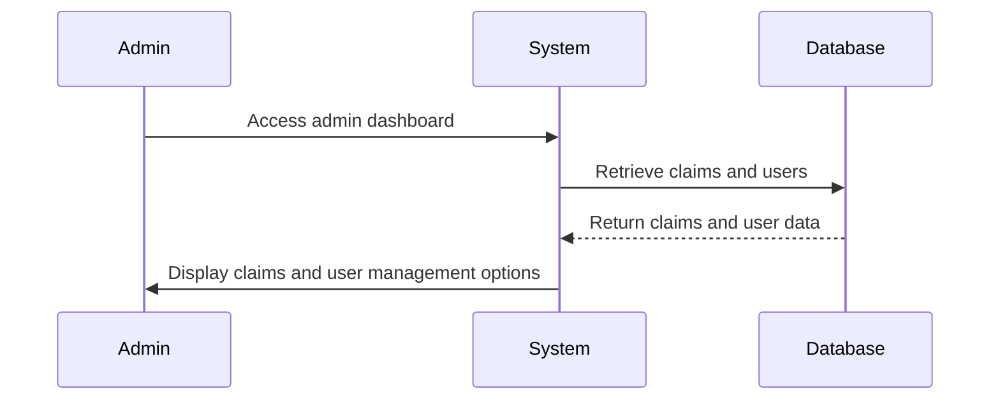
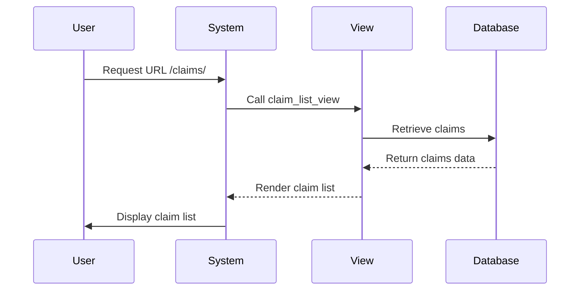
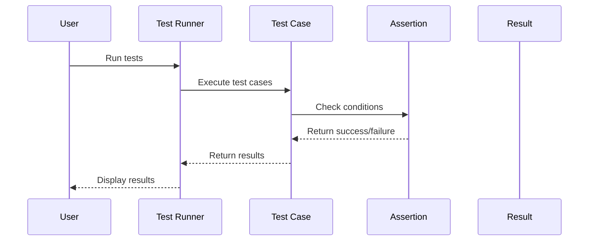

# ERISA Recovery - Claims Analysis Portal


*A full-stack web application designed for the ERISA Recovery team to analyze, manage, and collaborate on insurance claims.*

---


## 📋 Table of Contents

- [About The Project](#-about-the-project)
- [Features](#-features)
- [Tech Stack](#️-tech-stack)
- [Getting Started](#-getting-started)
- [Evaluator's Guide](#-evaluators-guide)
- [Running Tests](#-running-tests)
- [Deployment](#️-deployment)

---
# Tutorial: Erisa_Recovery_Dev_Challenge

The **Erisa Recovery Dev Challenge** is a web application designed for managing insurance claims. It allows users to *create*, *update*, and *track* claims while ensuring secure **user authentication** and facilitating **data uploads**. The application also supports **notes and collaboration** among users, making it easier to communicate about claims and their statuses.


**Source Repository:** [Erisa_Recovery_Dev_Challenge](https://github.com/Reddy-kalwakolu/Erisa_Recovery_Dev_Challenge)


## Understand the code of this Project

## Chapters
1. [User Authentication](#chapter-1-user-authentication)
2. [Data Upload](#chapter-2-data-upload)
3. [Claim Management](#chapter-3-claim-management)
4. [Claim Status Tracking](#chapter-4-claim-status-tracking)
5. [Notes and Collaboration](#chapter-5-notes-and-collaboration)
6. [Administrative Interface](#chapter-6-administrative-interface)
7. [Chapter 7: URL Routing](#chapter-7-url-routing)
8. [Testing Framework](#chapter-8-testing-framework)


---
## 📖 About The Project

This web application is a lightweight solution that provides a modern, interactive interface for tracking claim statuses, annotating records, and identifying key financial trends to maximize revenue recovery.

[cite_start]This project was built as a submission for the **Dev Challenge 2025**[cite: 2110].

---

## ✨ Features

- **Secure User Authentication:** A complete registration and login system with robust validation for unique emails and interactive password strength feedback.
- **Action Center Dashboard:** A dynamic command center providing at-a-glance KPIs, prioritized work queues (High-Value Denials, Aging Claims), and a live team activity feed.
- **Interactive Claims List:**
  - **Live Search & Filtering:** Instantly search by patient, status, or insurer without full page reloads.
  - **HTMX-Powered Detail View:** Click "View" on any claim to open a detailed panel on the same page, preserving your context in the main list.
- **Collaboration Tools:**
  - **Claim Flagging:** Users can flag claims for personal review, which appear on their dashboard.
  - **Public & Private Notes:** Add timestamped notes to any claim, visible only to you or the entire team.
- **Comprehensive Audit Trail:** A complete, uneditable log of every status change for each claim.
- **Flexible Data Management:** An easy-to-use upload page to add new claims data from CSV or JSON files, with options to **append** or **overwrite**.
- **Robust Test Suite:** Comprehensive tests covering model integrity, business logic, security, and functionality.

---

## 🛠️ Tech Stack

This project was built using the specific technologies required by the development challenge:

- **Backend:** Django 5.2+ (Python)
- **Database:** SQLite
- **Frontend:** HTML5, Tailwind CSS (via CDN)
- **JavaScript:** HTMX & Alpine.js

---

## 🚀 Getting Started

To get a local copy up and running, follow these simple steps.

### Prerequisites

Make sure you have Python (version 3.11 or higher) installed on your system.

### Installation

1.  **Clone the Repository:**
    ```bash
    git clone <your-repository-url>
    cd <repository-directory>
    ```

2.  **Create and Activate a Virtual Environment:**
    - On Windows:
      ```bash
      python -m venv ErisaR_Venv
      .\ErisaR_Venv\Scripts\activate
      ```
    - On macOS / Linux:
      ```bash
      python3 -m venv ErisaR_Venv
      source ErisaR_Venv/bin/activate
      ```

3.  **Install Dependencies:**
    ```bash
    pip install -r requirements.txt
    ```

4.  **Create the Environment File:**
    Create a `.env` file in the project root and add the following, replacing the placeholder with a real Django secret key.
    ```env
    SECRET_KEY='django-insecure-your-secret-key-here'
    DEBUG=True
    ALLOWED_HOSTS=127.0.0.1,localhost
    ```

5.  **Apply Database Migrations:**
    This will create the `db.sqlite3` file and set up the necessary tables.
    ```bash
    python manage.py migrate
    ```

6.  **Load Initial Data (Required):**
    Use the custom management command to populate the database from the provided data files.
    ```bash
    python manage.py load_claims claims_data.json claim_details.json --mode overwrite
    ```
7.  **Run the Development Server:**
    ```bash
    python manage.py runserver
    ```
    The application will be available at **http://127.0.0.1:8000/**.

---

## ✔️ Evaluator's Guide

Follow these steps to test and verify all required features.

1.  **Create a User Account:**
    - Navigate to **http://www.cprk.online/login/**.
    - Create a new user (e.g., username: `evaluator`, password: `Password123#`).
    - After registration, you will be redirected to the login page.

2.  **Log In and Explore:**
    - Log in with your new credentials. You will land on the **Home** page.

3.  **Verify Core Features:**
    - **Dashboard:** Navigate to the **Dashboard**. Observe the KPI cards and prioritized lists.
    - **Claims List & Search:** Go to the **Claims** page. Use the top search bar to filter by "United" and see the list update instantly.
    - **HTMX Detail View:** On the Claims list, click the **"View"** button on any claim. A detailed panel will appear below the list without a page reload.
    - **Flag & Annotate:** With a claim's details open, use the **Quick Actions** card to **"Flag for Review"**. Then, add a note in the **Notes** card and save it.
    - **Data Upload:** Navigate to the **Upload** page. Download a template file, then re-upload it using the "Append" mode. You will be redirected to the dashboard with a success notification.

---

## 🧪 Running Tests

The project includes a comprehensive test suite. To run all tests, use the following command:
```bash
python manage.py test claims
```
---
# Chapter 1: User Authentication

Welcome to the first chapter of our tutorial on the `Erisa_Recovery_Dev_Challenge` project! In this chapter, we will explore the concept of **User Authentication**. Think of user authentication as a security guard at the entrance of a building, checking credentials and allowing only authorized personnel to enter. This process ensures that users can securely access their accounts and manage claims while keeping unauthorized users out.

## Why is User Authentication Important?

Imagine you have a personal account where you manage sensitive information, such as claims or personal details. You wouldn't want just anyone to access this information, right? User authentication helps solve this problem by verifying who you are before granting access to your account.

### Key Concepts of User Authentication

1. **Registration**: This is the process where a new user creates an account by providing their details, such as a username and email.
2. **Login**: After registration, users can log in to their accounts using their credentials.
3. **Authentication**: This is the verification process that checks if the provided credentials match those stored in the system.

### How to Use User Authentication

Let's walk through a simple use case: a user wants to create an account and then log in.

1. **User Registration**: The user fills out a registration form with their username and email.
2. **User Login**: After registering, the user can log in using their credentials.

Here’s a simplified example of what the registration form might look like:

```html
<form method="post">
    <label for="username">Username:</label>
    <input type="text" name="username" required>
    
    <label for="email">Email:</label>
    <input type="email" name="email" required>
    
    <button type="submit">Register</button>
</form>
```

In this form, the user provides their username and email. When they submit the form, the system will create a new account for them.

### Internal Implementation of User Authentication

When a user registers or logs in, several steps happen behind the scenes. Here’s a simple sequence diagram to illustrate the process:



1. The user submits their registration or login form.
2. The system checks the database to see if the user already exists (for registration) or if the credentials match (for login).
3. The system responds to the user with a success message.

### Code Walkthrough

Let's take a look at the code that handles user registration. This is found in the `claims/forms.py` file:

```python
from django.contrib.auth.forms import UserCreationForm
from django.contrib.auth.models import User
from django import forms

class CustomUserCreationForm(UserCreationForm):
    class Meta(UserCreationForm.Meta):
        model = User
        fields = ('username', 'email')

    def clean_email(self):
        email = self.cleaned_data.get('email')
        if email and User.objects.filter(email__iexact=email).exists():
            raise forms.ValidationError("An account with this email address already exists.")
        return email
```

- **UserCreationForm**: This is a built-in Django form that helps create new users.
- **clean_email**: This method checks if the email provided is already in use. If it is, it raises a validation error.

Now, let’s look at the login form in the `claims/templates/claims/login.html` file:

```html
<form method="post">
    
    <label for="username">Username:</label>
    <input type="text" name="username" required>
    
    <label for="password">Password:</label>
    <input type="password" name="password" required>
    
    <button type="submit">Sign In</button>
</form>
```

- This form allows users to enter their username and password to log in.

### Conclusion

In this chapter, we learned about user authentication, its importance, and how it works in our project. We explored the registration and login processes, along with the underlying code that supports these functionalities. 

In the next chapter, we will dive into **Data Upload**, where we will learn how users can upload their documents securely. You can read about it here: [Data Upload](02_data_upload_.md).

---

# Chapter 2: Data Upload

Welcome back! In the previous chapter, we learned about **User Authentication**, which ensures that only authorized users can access their accounts. Now, let’s dive into a new and exciting concept: **Data Upload**. 

## What is Data Upload?

Imagine you have a big box of claims data that you need to bring into your application. Instead of entering each claim manually, you can simply upload a file containing all the information at once! This is what the Data Upload feature does. It allows users to upload claim data from files, either in JSON or CSV format, making the process quick and efficient.

### Why is Data Upload Important?

Think of Data Upload as a conveyor belt that brings new information into the system. It automatically processes and integrates the data into the existing database, ensuring that your application is always up-to-date with the latest claims. This feature simplifies the data entry process and saves you a lot of time!

## Key Concepts of Data Upload

Let’s break down the key concepts of Data Upload:

1. **File Formats**: You can upload data in two formats: JSON and CSV. 
   - **JSON (JavaScript Object Notation)**: A lightweight format that is easy for humans to read and write, and easy for machines to parse and generate.
   - **CSV (Comma-Separated Values)**: A simple format used to store tabular data, where each line represents a row and each value is separated by a comma.

2. **Upload Process**: The process involves selecting your files, choosing how you want to upload the data (either append to existing data or overwrite it), and then submitting the files for processing.

3. **Data Processing**: Once the files are uploaded, the system reads the data, validates it, and then saves it into the database.

## How to Use Data Upload

Let’s walk through a simple use case: you want to upload claims data and claim details from two files.

### Step 1: Prepare Your Files

Make sure your files are in the correct format. You can download templates for both JSON and CSV formats from the application.

### Step 2: Upload Your Files

Here’s what the upload form might look like:

```html
<form method="post" enctype="multipart/form-data">
    <label for="claims_file">Claims Data File:</label>
    <input type="file" name="claims_file" required>
    
    <label for="details_file">Claim Details File:</label>
    <input type="file" name="details_file" required>
    
    <button type="submit">Upload Files</button>
</form>
```

In this form, you select your claims data file and claim details file, then click the "Upload Files" button. 

### Step 3: Choose Upload Mode

You can choose between two modes:
- **Append**: Add new data while keeping existing records.
- **Overwrite**: Delete all old data before uploading the new data.

### Example Input and Output

- **Input**: You upload a CSV file named `claims.csv` and a JSON file named `details.json`.
- **Output**: The system processes the files and updates the database with the new claims and details.

## Internal Implementation of Data Upload

When you upload files, several steps happen behind the scenes. Here’s a simple sequence diagram to illustrate the process:



1. The user uploads the claims and details files.
2. The system parses the files to extract data.
3. The parsed data is validated to ensure it’s correct.
4. If valid, the data is saved to the database.
5. The user receives a success message.

### Code Walkthrough

Let’s take a look at the code that handles the data upload process. This is found in the `claims/utils.py` file:

```python
def parse_data_from_stream(file_stream, filename):
    if filename.endswith('.json'):
        return json.loads(file_stream.read().decode('utf-8'))
    elif filename.endswith('.csv'):
        reader = csv.DictReader(io.StringIO(file_stream.read().decode('utf-8')))
        return [row for row in reader]
    else:
        raise ValueError("Unsupported file format.")
```

- **parse_data_from_stream**: This function reads the uploaded file and determines its format. It then parses the data into a list of dictionaries for further processing.

Next, let’s see how the data is processed in the `claims/management/commands/load_claims.py` file:

```python
def handle(self, *args, **options):
    with open(claims_file_path, 'rb') as f_claims:
        claims_data = parse_data_from_stream(f_claims, claims_file_path)
    
    # Process claims data...
```

- **handle**: This function is responsible for handling the upload command. It reads the claims file, parses the data, and then processes it.

## Conclusion

In this chapter, we learned about the **Data Upload** feature, its importance, and how it works in our project. We explored the process of uploading claims and details, along with the underlying code that supports these functionalities.

In the next chapter, we will dive into **Claim Management**, where we will learn how to manage and organize claims effectively. You can read about it here: [Claim Management](03_claim_management_.md).

---

# Chapter 3: Claim Management

Welcome back! In the previous chapter, we explored **Data Upload**, where users could easily bring their claims data into the application. Now, let's dive into a crucial aspect of our project: **Claim Management**.

## What is Claim Management?

Imagine you have a filing cabinet filled with folders, and each folder contains important information about a patient's insurance claim. **Claim Management** is like that filing cabinet, allowing users to create, update, and track the status of claims efficiently. This ensures that all necessary details are organized and easily accessible.

### Why is Claim Management Important?

Think of Claim Management as the backbone of our application. It helps users keep track of claims, understand their statuses, and manage any necessary actions. Without a solid claim management system, it would be challenging to handle the complexities of insurance claims.

## Key Concepts of Claim Management

Let’s break down the key concepts of Claim Management:

1. **Claim**: This is the main entity that holds all relevant information about a patient's claim, such as the claim ID, patient name, billed amount, paid amount, and status.
  
2. **Claim Status**: Each claim can have different statuses, such as "Paid," "Denied," or "Under Review." This helps users understand where each claim stands in the process.

3. **Claim Details**: Additional information related to a claim, such as CPT codes and denial reasons, which provide more context about the claim.

4. **Notes**: Users can add notes to claims for collaboration or personal reminders, helping keep track of important information.

5. **Claim History**: This records any changes made to a claim, such as status updates, allowing users to see the claim's journey over time.

## How to Use Claim Management

Let’s walk through a simple use case: a user wants to create a new claim and update its status.

### Step 1: Create a New Claim

To create a new claim, you would typically fill out a form with the necessary details. Here’s a simplified example of what the form might look like:

```html
<form method="post">
    <label for="claim_id">Claim ID:</label>
    <input type="number" name="claim_id" required>
    
    <label for="patient_name">Patient Name:</label>
    <input type="text" name="patient_name" required>
    
    <label for="billed_amount">Billed Amount:</label>
    <input type="number" name="billed_amount" required>
    
    <button type="submit">Create Claim</button>
</form>
```

In this form, the user provides the claim ID, patient name, and billed amount. When submitted, the system will create a new claim.

### Step 2: Update Claim Status

Once a claim is created, the user might want to update its status. Here’s how that might look:

```html
<form method="post">
    <label for="status">Update Status:</label>
    <select name="status">
        <option value="Paid">Paid</option>
        <option value="Denied">Denied</option>
        <option value="Under Review">Under Review</option>
    </select>
    
    <button type="submit">Update Status</button>
</form>
```

This form allows the user to select a new status for the claim. Upon submission, the system will update the claim's status accordingly.

### Example Input and Output

- **Input**: The user creates a claim with ID `101`, patient name `John Doe`, and billed amount `1000.00`.
- **Output**: The system creates a new claim and stores it in the database. The user can then view this claim in their list of claims.

## Internal Implementation of Claim Management

When a user creates or updates a claim, several steps happen behind the scenes. Here’s a simple sequence diagram to illustrate the process:



1. The user submits the claim creation or update form.
2. The system saves or updates the claim data in the database.
3. The database confirms the operation's success.
4. The system displays a success message to the user.

### Code Walkthrough

Let’s take a look at the code that handles claim creation and updates. This is found in the `claims/models.py` file:

```python
class Claim(models.Model):
    claim_id = models.IntegerField(unique=True)
    patient_name = models.CharField(max_length=255)
    billed_amount = models.DecimalField(max_digits=10, decimal_places=2)
    status = models.CharField(max_length=50, default='Under Review')

    def __str__(self):
        return f"Claim {self.claim_id} - {self.patient_name}"
```

- **Claim Model**: This defines the structure of a claim in our database. It includes fields for the claim ID, patient name, billed amount, and status.
- **__str__ Method**: This method returns a string representation of the claim, making it easier to read in the admin interface.

Next, let’s see how the claim is created in the `claims/views.py` file:

```python
@login_required
def create_claim_view(request):
    if request.method == 'POST':
        claim_id = request.POST['claim_id']
        patient_name = request.POST['patient_name']
        billed_amount = request.POST['billed_amount']
        
        claim = Claim.objects.create(
            claim_id=claim_id,
            patient_name=patient_name,
            billed_amount=billed_amount
        )
        return redirect('claims:claim-list')
```

- **create_claim_view**: This function handles the claim creation process. It retrieves data from the form and creates a new claim in the database.

## Conclusion

In this chapter, we learned about **Claim Management**, its importance, and how it works in our project. We explored how to create and update claims, along with the underlying code that supports these functionalities.

In the next chapter, we will dive into **Claim Status Tracking**, where we will learn how to monitor and manage the status of claims effectively. You can read about it here: [Claim Status Tracking](04_claim_status_tracking_.md).

---
# Chapter 4: Claim Status Tracking

Welcome back! In the previous chapter, we explored **Claim Management**, where we learned how to create and update claims. Now, let's dive into an essential feature of our project: **Claim Status Tracking**.

## What is Claim Status Tracking?

Imagine you submitted a claim for a medical expense, and you want to know what’s happening with it. Is it being reviewed? Has it been paid? Or was it denied? **Claim Status Tracking** is like a traffic light for your claims, showing you whether they are moving forward, stalled, or resolved. This feature helps you prioritize your actions based on the current status of each claim.

### Why is Claim Status Tracking Important?

Think of Claim Status Tracking as your personal assistant for managing claims. It keeps you informed about the progress of each claim, allowing you to take timely actions. Without this feature, you might miss important updates or deadlines, leading to delays in payments or resolutions.

## Key Concepts of Claim Status Tracking

Let’s break down the key concepts of Claim Status Tracking:

1. **Claim Status**: Each claim can have different statuses, such as:
   - **Under Review**: The claim is being evaluated.
   - **Paid**: The claim has been successfully processed and paid.
   - **Denied**: The claim was not approved for payment.
   - **Appealed**: The claim is under reconsideration after being denied.

2. **Status Updates**: As claims progress, their statuses change. Tracking these updates helps you stay informed.

3. **Claim History**: This records any changes made to a claim's status, allowing you to see its journey over time.

## How to Use Claim Status Tracking

Let’s walk through a simple use case: you want to check the status of a claim and update it if necessary.

### Step 1: Check Claim Status

When you want to check the status of a claim, you can view it in the application. Here’s a simplified example of what the claim status might look like:

```html
<div>
    <h3>Claim ID: 101</h3>
    <p>Status: <span id="status-badge">Under Review</span></p>
</div>
```

In this example, the claim with ID `101` is currently "Under Review." You can see the status clearly displayed.

### Step 2: Update Claim Status

If you need to update the status of a claim, you can use a form like this:

```html
<form method="post">
    <label for="status">Update Status:</label>
    <select name="status">
        <option value="Paid">Paid</option>
        <option value="Denied">Denied</option>
        <option value="Under Review">Under Review</option>
    </select>
    <button type="submit">Update Status</button>
</form>
```

In this form, you select a new status for the claim. When submitted, the system will update the claim's status accordingly.

### Example Input and Output

- **Input**: You select "Paid" from the dropdown for claim ID `101`.
- **Output**: The system updates the claim status to "Paid" and displays a success message.

## Internal Implementation of Claim Status Tracking

When you check or update a claim's status, several steps happen behind the scenes. Here’s a simple sequence diagram to illustrate the process:



1. The user requests the claim status.
2. The system retrieves the status from the database.
3. The system displays the current status to the user.
4. The user submits a new status.
5. The system updates the status in the database.
6. The system confirms the update and displays a success message.

### Code Walkthrough

Let’s take a look at the code that handles claim status tracking. This is found in the `claims/models.py` file:

```python
class Claim(models.Model):
    STATUS_CHOICES = [
        ('Denied', 'Denied'),
        ('Paid', 'Paid'),
        ('Under Review', 'Under Review'),
        ('Appealed', 'Appealed'),
    ]

    status = models.CharField(
        max_length=50,
        choices=STATUS_CHOICES,
        default='Under Review',
        db_index=True
    )
```

- **Claim Model**: This defines the structure of a claim in our database. The `status` field uses `STATUS_CHOICES` to limit the possible values to our predefined statuses.

Next, let’s see how the status is updated in the `claims/views.py` file:

```python
@login_required
def change_claim_status_view(request, pk):
    claim = get_object_or_404(Claim, pk=pk)
    if request.method == 'POST':
        new_status = request.POST.get('status')
        if new_status in dict(Claim.STATUS_CHOICES):
            claim.status = new_status
            claim.save()
        return redirect('claims:claim-detail', pk=pk)
```

- **change_claim_status_view**: This function handles the status update process. It retrieves the claim and updates its status based on the user's selection.

## Conclusion

In this chapter, we learned about **Claim Status Tracking**, its importance, and how it works in our project. We explored how to check and update claim statuses, along with the underlying code that supports these functionalities.

In the next chapter, we will dive into **Notes and Collaboration**, where we will learn how to add notes and collaborate on claims effectively. You can read about it here: [Notes and Collaboration](05_notes_and_collaboration_.md).

---
# Chapter 5: Notes and Collaboration

Welcome back! In the previous chapter, we explored **Claim Status Tracking**, where we learned how to monitor and manage the status of claims effectively. Now, let's dive into an exciting feature of our project: **Notes and Collaboration**.

## What is Notes and Collaboration?

Imagine you and your team are working on a complex insurance claim. You might have thoughts, reminders, or important comments that need to be shared. **Notes and Collaboration** is like a shared whiteboard where everyone can jot down their ideas related to specific claims. This feature enhances communication and ensures that important information is documented and easily accessible.

### Why is Notes and Collaboration Important?

Think of this feature as a way to keep everyone on the same page. When team members can add notes to claims, it fosters collaboration and ensures that no important detail is overlooked. It helps in tracking discussions, decisions, and reminders, making the claim management process smoother and more efficient.

## Key Concepts of Notes and Collaboration

Let’s break down the key concepts of this feature:

1. **Notes**: These are comments or reminders that users can add to a claim. They can be personal or shared with colleagues.
  
2. **Visibility**: Notes can be marked as public or private. Public notes are visible to all team members, while private notes are only visible to the user who created them.

3. **Claim Association**: Each note is linked to a specific claim, ensuring that all relevant information is organized and easy to find.

## How to Use Notes and Collaboration

Let’s walk through a simple use case: you want to add a note to a claim and share it with your colleagues.

### Step 1: Adding a Note

To add a note, you would typically fill out a form like this:

```html
<form method="post">
    <textarea name="note_text" placeholder="Add a new note..."></textarea>
    <input type="checkbox" name="is_public"> Make this note visible to colleagues
    <button type="submit">Save Note</button>
</form>
```

In this form, you write your note and decide if you want to share it with your team. When you click "Save Note," the system will store it.

### Step 2: Viewing Notes

Once notes are added, you can view them associated with the claim:

```html
<div>
    <h3>Notes for Claim ID: 101</h3>
    <p>Note by Alice: Remember to follow up on this claim.</p>
    <p>Note by Bob: This claim needs additional documentation.</p>
</div>
```

Here, you can see all the notes related to Claim ID `101`. Each note shows who wrote it, making it easy to track discussions.

### Example Input and Output

- **Input**: You add a note saying, "Check for additional documents" and mark it as public.
- **Output**: The note is saved and displayed to all team members working on that claim.

## Internal Implementation of Notes and Collaboration

When you add or view notes, several steps happen behind the scenes. Here’s a simple sequence diagram to illustrate the process:



1. The user submits the note form.
2. The system saves the note data in the database.
3. The database confirms the save operation.
4. The system displays a success message to the user.

### Code Walkthrough

Let’s take a look at the code that handles notes. This is found in the `claims/models.py` file:

```python
class Note(models.Model):
    claim = models.ForeignKey(Claim, on_delete=models.CASCADE, related_name="notes")
    user = models.ForeignKey(User, on_delete=models.CASCADE)
    text = models.TextField()
    created_at = models.DateTimeField(auto_now_add=True)
    is_public = models.BooleanField(default=False)

    def __str__(self):
        return f"Note by {self.user.username} on Claim {self.claim.id}"
```

- **Note Model**: This defines the structure of a note in our database. Each note is linked to a specific claim and user, and it includes the note text and visibility status.

Next, let’s see how the note is added in the `claims/views.py` file:

```python
@login_required
def add_note_view(request, claim_id):
    claim = get_object_or_404(Claim, id=claim_id)
    if request.method == 'POST':
        note_text = request.POST['note_text']
        is_public = 'is_public' in request.POST
        Note.objects.create(claim=claim, user=request.user, text=note_text, is_public=is_public)
        return redirect('claims:claim-detail', pk=claim_id)
```

- **add_note_view**: This function handles adding a note. It retrieves the claim and creates a new note based on the user's input.

## Conclusion

In this chapter, we learned about **Notes and Collaboration**, its importance, and how it works in our project. We explored how to add and view notes related to claims, along with the underlying code that supports these functionalities.

In the next chapter, we will dive into the **Administrative Interface**, where we will learn how to manage users and claims effectively. You can read about it here: [Administrative Interface](06_administrative_interface_.md).

---
# Chapter 6: Administrative Interface

Welcome back! In the previous chapter, we explored **Notes and Collaboration**, where we learned how to add notes and collaborate on claims effectively. Now, let's dive into an essential feature of our project: the **Administrative Interface**.

## What is the Administrative Interface?

Imagine you are the manager of a busy restaurant. You need a control panel to oversee everything: from managing staff schedules to ensuring that customers are satisfied. The **Administrative Interface** serves a similar purpose in our application. It provides administrators with the tools to manage claims and users effectively, ensuring that everything runs smoothly.

### Why is the Administrative Interface Important?

Think of the Administrative Interface as the command center of our application. It allows administrators to:
- Manage user permissions.
- Oversee claims processing.
- Ensure the integrity and functionality of the application.

Without this interface, it would be challenging to maintain order and efficiency in the system.

## Key Concepts of the Administrative Interface

Let’s break down the key concepts of the Administrative Interface:

1. **User Management**: This allows administrators to add, remove, or modify user accounts and their permissions. It ensures that only authorized personnel can access sensitive information.

2. **Claim Oversight**: Administrators can view and manage all claims in the system. This includes approving, denying, or flagging claims for further review.

3. **Dashboard**: A visual overview of the system's status, including the number of claims processed, pending claims, and user activity. This helps administrators make informed decisions quickly.

## How to Use the Administrative Interface

Let’s walk through a simple use case: an administrator wants to view all claims and manage user permissions.

### Step 1: Access the Administrative Interface

To access the Administrative Interface, you typically navigate to a specific URL in your application, such as `/admin`. Here, you will see a dashboard displaying various options.

### Step 2: View Claims

Once in the interface, you can view all claims. Here’s a simplified example of what the claims list might look like:

```html
<table>
    <tr>
        <th>Claim ID</th>
        <th>Patient Name</th>
        <th>Status</th>
    </tr>
    <tr>
        <td>101</td>
        <td>John Doe</td>
        <td>Under Review</td>
    </tr>
    <tr>
        <td>102</td>
        <td>Jane Smith</td>
        <td>Paid</td>
    </tr>
</table>
```

In this table, the administrator can see all claims along with their statuses. This allows for quick oversight of the claims process.

### Step 3: Manage Users

Administrators can also manage user accounts. Here’s a simple form to add a new user:

```html
<form method="post">
    <label for="username">Username:</label>
    <input type="text" name="username" required>
    
    <label for="email">Email:</label>
    <input type="email" name="email" required>
    
    <button type="submit">Add User</button>
</form>
```

In this form, the administrator can add a new user by providing their username and email. When submitted, the system will create a new user account.

### Example Input and Output

- **Input**: The administrator adds a user with the username `admin_user` and email `admin@example.com`.
- **Output**: The system creates a new user account and displays a success message.

## Internal Implementation of the Administrative Interface

When an administrator accesses the interface, several steps happen behind the scenes. Here’s a simple sequence diagram to illustrate the process:



1. The administrator accesses the admin dashboard.
2. The system retrieves claims and user data from the database.
3. The database returns the requested data.
4. The system displays the claims and user management options to the administrator.

### Code Walkthrough

Let’s take a look at the code that handles the administrative interface. This is found in the `claims/admin.py` file:

```python
from django.contrib import admin
from .models import Claim, User

# Register models for admin interface
admin.site.register(Claim)
admin.site.register(User)
```

- **admin.py**: This file registers the `Claim` and `User` models with the Django admin site, making them accessible through the Administrative Interface.

Next, let’s see how the user management works in the `claims/views.py` file:

```python
@login_required
def add_user_view(request):
    if request.method == 'POST':
        username = request.POST['username']
        email = request.POST['email']
        User.objects.create(username=username, email=email)
        return redirect('admin:users')
```

- **add_user_view**: This function handles adding a new user. It retrieves data from the form and creates a new user in the database.

## Conclusion

In this chapter, we learned about the **Administrative Interface**, its importance, and how it works in our project. We explored how to manage claims and users, along with the underlying code that supports these functionalities.

In the next chapter, we will dive into **URL Routing**, where we will learn how to manage the navigation and structure of our application effectively. You can read about it here: [URL Routing](07_url_routing_.md).

---
# Chapter 7: URL Routing

Welcome back! In the previous chapter, we explored the **Administrative Interface**, where we learned how to manage claims and users effectively. Now, let's dive into an essential concept of our project: **URL Routing**.

## What is URL Routing?

Imagine you are navigating a large library. Each section has a specific address, guiding you to the right aisle to find the book you need. **URL Routing** serves a similar purpose in our application. It defines how different parts of the application are accessed via URLs, acting as a map that guides users to various sections, such as the claim list, dashboard, or upload page. Proper routing is essential for a seamless user experience.

### Why is URL Routing Important?

Without URL routing, users would struggle to navigate the application. They might not know how to access the claim list or upload new claims. URL routing ensures that every part of the application is easily reachable, making it user-friendly and efficient.

## Key Concepts of URL Routing

Let’s break down the key concepts of URL Routing:

1. **URL Patterns**: These are the specific paths that users can follow to reach different parts of the application. For example, `/claims/` might lead to the claim list.

2. **Views**: Each URL pattern is linked to a specific function in the application, known as a view. This function determines what content is displayed when a user visits that URL.

3. **Parameters**: Sometimes, URLs can include parameters that allow users to access specific resources. For example, `/claim/101/` might show the details of claim number 101.

## How to Use URL Routing

Let’s walk through a simple use case: you want to access the claim list and view a specific claim.

### Step 1: Access the Claim List

To access the claim list, you would navigate to the URL `/claims/`. Here’s how the URL routing is defined in our `claims/urls.py` file:

```python
from django.urls import path
from . import views

app_name = 'claims'

urlpatterns = [
    path('claims/', views.claim_list_view, name='claim-list'),  # URL for claim list
]
```

In this code, we define a URL pattern for the claim list. When a user visits `/claims/`, the `claim_list_view` function will be called to display the claim list.

### Step 2: View a Specific Claim

To view a specific claim, you would navigate to a URL like `/claim/101/`. Here’s how that is defined:

```python
urlpatterns = [
    path('claim/<int:pk>/', views.claim_detail_view, name='claim-detail'),  # URL for claim details
]
```

In this code, `<int:pk>` is a parameter that allows us to pass the claim ID (in this case, `101`) to the `claim_detail_view` function. This function will then display the details of that specific claim.

### Example Input and Output

- **Input**: You navigate to `/claims/`.
- **Output**: The system displays a list of all claims.

- **Input**: You navigate to `/claim/101/`.
- **Output**: The system displays the details of claim number 101.

## Internal Implementation of URL Routing

When a user accesses a URL, several steps happen behind the scenes. Here’s a simple sequence diagram to illustrate the process:



1. The user requests the URL `/claims/`.
2. The system calls the `claim_list_view` function.
3. The view retrieves the claims data from the database.
4. The view renders the claim list.
5. The system displays the claim list to the user.

### Code Walkthrough

Let’s take a look at the code that handles URL routing in our `claims/urls.py` file:

```python
from django.urls import path
from . import views

urlpatterns = [
    path('claims/', views.claim_list_view, name='claim-list'),  # Claim list URL
    path('claim/<int:pk>/', views.claim_detail_view, name='claim-detail'),  # Claim detail URL
]
```

- **path()**: This function defines a URL pattern. The first argument is the URL, the second is the view function to call, and the third is an optional name for the URL.

Next, let’s see how the view functions are defined in the `claims/views.py` file:

```python
from django.shortcuts import render
from .models import Claim

def claim_list_view(request):
    claims = Claim.objects.all()  # Retrieve all claims
    return render(request, 'claims/claim_list.html', {'claims': claims})  # Render claim list

def claim_detail_view(request, pk):
    claim = Claim.objects.get(pk=pk)  # Retrieve specific claim by ID
    return render(request, 'claims/claim_detail.html', {'claim': claim})  # Render claim details
```

- **claim_list_view**: This function retrieves all claims and renders them in the `claim_list.html` template.
- **claim_detail_view**: This function retrieves a specific claim based on the provided ID and renders it in the `claim_detail.html` template.

## Conclusion

In this chapter, we learned about **URL Routing**, its importance, and how it works in our project. We explored how to define URL patterns, link them to views, and use parameters to access specific resources.

In the next chapter, we will dive into the **Testing Framework**, where we will learn how to ensure our application works correctly through testing. You can read about it here: [Testing Framework](08_testing_framework_.md).

---
# Chapter 8: Testing Framework

Welcome back! In the previous chapter, we explored **URL Routing**, where we learned how to manage the navigation and structure of our application effectively. Now, let's dive into an essential concept of our project: the **Testing Framework**.

## What is a Testing Framework?

Imagine you are a chef in a busy restaurant. Before serving a dish, you taste it to ensure it’s perfect. A **Testing Framework** acts like that taste test for our application. It helps us check if everything is working correctly, ensuring that our application is free from errors and bugs. This framework runs automated tests to maintain high standards and reliability in our application.

### Why is a Testing Framework Important?

Think of the Testing Framework as a safety net. It catches issues before they reach the users, ensuring that the application behaves as expected. Without it, we might release features that break existing functionality or introduce new bugs, leading to a poor user experience.

## Key Concepts of a Testing Framework

Let’s break down the key concepts of a Testing Framework:

1. **Test Cases**: These are individual tests that check specific functionality. For example, a test case might check if a user can successfully log in.

2. **Assertions**: These are statements that verify if the outcome of a test matches the expected result. If the assertion fails, the test fails.

3. **Test Suites**: A collection of test cases that can be run together. This helps organize tests and run them efficiently.

4. **Test Runner**: This is the tool that executes the tests and reports the results. It tells you which tests passed and which failed.

## How to Use the Testing Framework

Let’s walk through a simple use case: we want to test if a user can successfully log in.

### Step 1: Create a Test Case

We start by creating a test case for the login functionality. Here’s a simplified example:

```python
from django.test import TestCase
from django.urls import reverse

class LoginTests(TestCase):
    def test_login_success(self):
        response = self.client.post(reverse('claims:login'), {
            'username': 'testuser',
            'password': 'password123'
        })
        self.assertEqual(response.status_code, 200)  # Check if the response is OK
```

In this code, we create a test case called `LoginTests` that checks if a user can log in successfully. The `assertEqual` statement verifies that the response status is 200, meaning the login was successful.

### Step 2: Run the Test

To run the test, you would typically use a command in your terminal:

```bash
python manage.py test claims
```

This command runs all the tests in the `claims` app. If everything is working correctly, you should see output indicating that the tests passed.

### Example Input and Output

- **Input**: You run the test for the login functionality.
- **Output**: The system displays a message indicating that all tests passed, confirming that the login functionality works as expected.

## Internal Implementation of the Testing Framework

When you run tests, several steps happen behind the scenes. Here’s a simple sequence diagram to illustrate the process:



1. The user runs the tests using the test runner.
2. The test runner executes each test case.
3. Each test case checks conditions using assertions.
4. The assertions return success or failure to the test case.
5. The test runner collects results and displays them to the user.

### Code Walkthrough

Let’s take a look at the code that handles the testing framework. This is typically found in the `claims/tests.py` file:

```python
from django.test import TestCase

class ExampleTests(TestCase):
    def test_example_functionality(self):
        # Test some functionality
        self.assertTrue(True)  # This will always pass
```

- **ExampleTests**: This class contains our test cases. The `test_example_functionality` method is a simple test that always passes.

Next, let’s see how we can check for specific functionality, like ensuring a claim can be created:

```python
from .models import Claim

class ClaimTests(TestCase):
    def test_create_claim(self):
        claim = Claim.objects.create(claim_id=101, patient_name='John Doe', billed_amount=1000.00)
        self.assertEqual(claim.patient_name, 'John Doe')  # Check if the claim was created correctly
```

- **ClaimTests**: This class tests the `Claim` model. The `test_create_claim` method creates a claim and checks if the patient name is correct.

## Conclusion

In this chapter, we learned about the **Testing Framework**, its importance, and how it works in our project. We explored how to create test cases, run tests, and verify functionality, ensuring our application is reliable and free from bugs.

In the next chapter, we will dive into **Deployment**, where we will learn how to deploy our application to a live server. You can read about it here: [Deployment](09_deployment.md).

---


